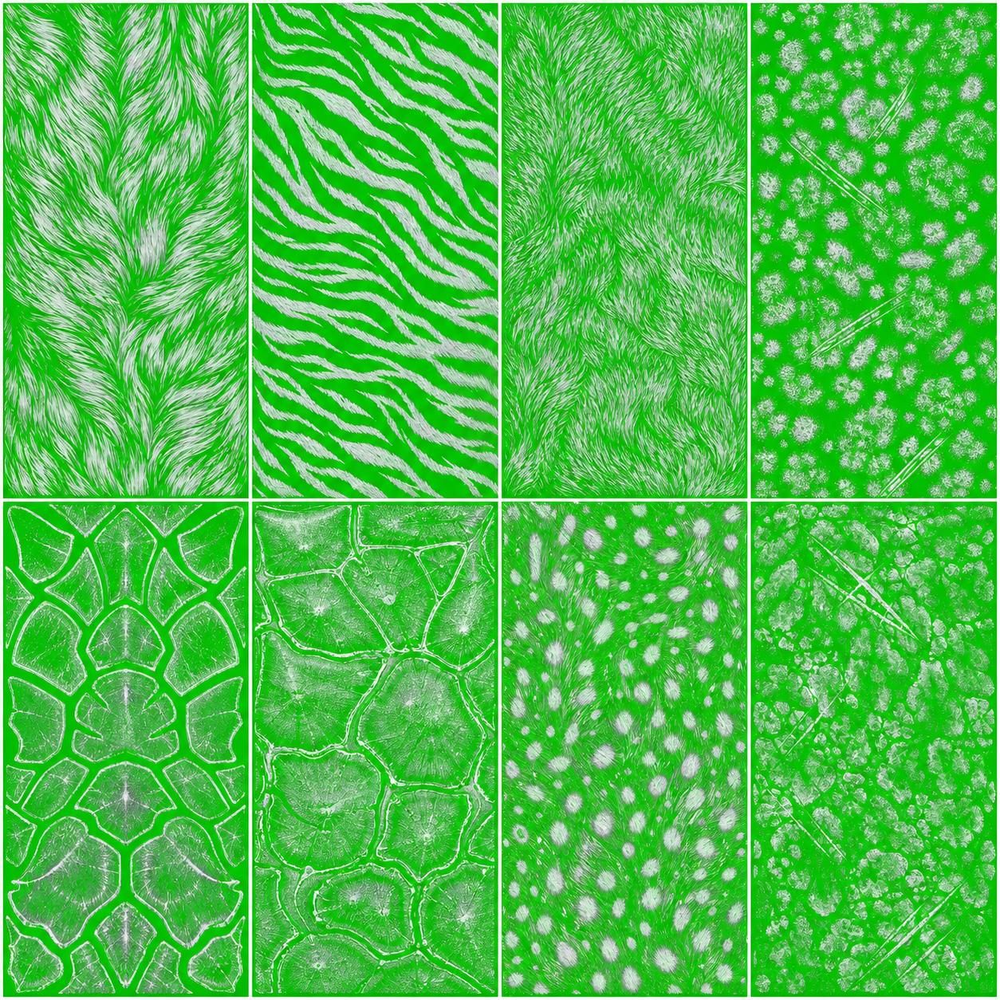
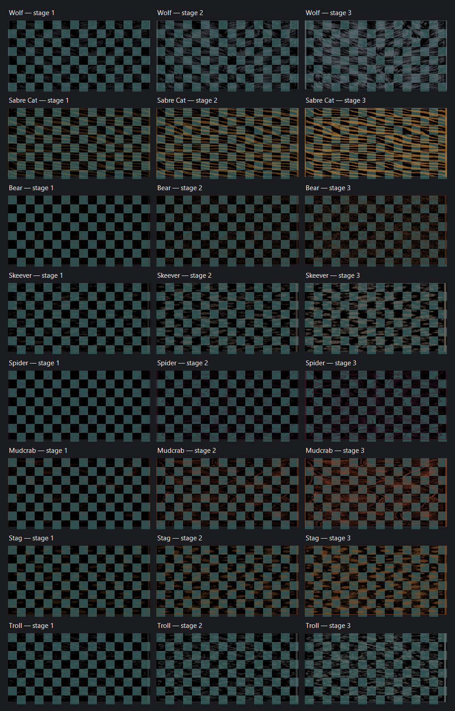

# Feral - Bodymorph Alterations add-on

Feral v5 turns hunting into a smooth transformation progression. Personally kill supported creatures, harvest every waiting essence with one cast, and grow eight distinct temporary feral-glamour shapes. Combat bonuses exist only while transformed.

## Requirements

Skyrim SE/AE, SKSE, SkyUI, PapyrusUtil, powerofthree's Papyrus Extender, Experience, RaceMenu/NiOverride, SlaveTats NG, and Bodymorph Alterations (`Dollform.esp`). Load `Feral.esp` after `Dollform.esp`.

Install the complete **Feral - Bodymorph Addon** folder as one MO2 mod; do not install only the ESP. On an existing save, wait for SkyUI registration before opening Mod Configuration. Feral normally registers automatically. If **Feral** alone is missing after a minute, run `setstage SKI_ConfigManagerInstance 1` once in the console, close the menus, and wait for SkyUI's registration notification. A large red `Total MCM` number is the number of registered menus, not by itself a Feral error.

## Hunting and mastery

1. Enable Feral hunting in the **Feral** MCM.
2. Personally kill any supported wolf, sabre cat, bear, skeever, spider, mudcrab, deer/stag, or troll.
3. Cast **Claim Soul** within the configurable 60-300 real-second window. One cast harvests every waiting eligible kill, so combat never needs to be interrupted.
4. Each claim permanently improves that family's expression. Rank 1 begins at 50%, rank 2 crosses 75%, and rank 3 reaches 100%; every claim between milestones increases stats and morph intensity.

| Family | Rank thresholds | Full-expression transformed benefits |
|---|---:|---|
| Wolf | 2 / 7 / 16 | +12% speed, +35% stamina regeneration, +15 unarmed damage |
| Sabre Cat | 1 / 5 / 12 | +25 Sneak, +25 unarmed damage, +10% attack speed |
| Bear | 1 / 4 / 10 | +100 armor, +50 Health, +25 stagger resistance |
| Skeever | 3 / 8 / 18 | +60% poison/disease resistance, +20 Sneak, +30 carry weight |
| Spider | 2 / 7 / 16 | +80% poison resistance, +30 unarmed damage, +15% speed |
| Mudcrab | 2 / 7 / 16 | +140 armor, +20 Block, +30 stagger resistance, -8% speed |
| Stag | 2 / 6 / 14 | +15% speed, +80 Stamina, +20 Archery |
| Troll | 1 / 3 / 7 | +2 Health regeneration, +25 melee damage, +60 Health, -40% fire resistance, -8% speed |

Shapes last 120 seconds. A 15-second fatigue follows cleanup to prevent instant form swapping. **Return to Self** ends a shape early. Feral and Bodymorph Alterations share one transformation lock and cannot overwrite each other.

## Visual progression

Every family has a default 10-12 slider silhouette, three progressively richer 2K SlaveTats body textures, a transformation shader, sound, and camera pulse. Morph magnitude follows the exact expression percentage shown in the MCM: 50% at rank 1, 75% at rank 2, 100% at rank 3, with smooth growth between milestones.

| Family | Default silhouette at full expression | Marking |
|---|---|---|
| Wolf | Muscular thighs, calves, and rear; narrower waist; modest shoulders | Blue-gray directional pelt |
| Sabre Cat | Fuller thighs, hips, and rear; strongly narrowed waist; lighter arms | Tawny horizontal stripes |
| Bear | Very large muscular arms and shoulders; thick legs, waist, and torso | Dark brown heavy-fur mantle |
| Skeever | Small wiry arms, shoulders, thighs, waist, and rear; slightly stronger calves | Gray-brown scarred mottle |
| Spider | Very narrow waist; broad hips and rear; moderately stronger arms | Dark plum chitin webbing |
| Mudcrab | Broad shoulders, arms, waist, hips, thighs, and calves | Rust-orange carapace plates |
| Stag | Powerful muscular thighs and calves; athletic rear; narrow waist and lighter arms | Warm brown dappling |
| Troll | Largest arms and shoulders; strong abs and legs; thick waist and torso | Gray-green rough hide |

The source atlas shows the intended creature identities:

This transparency contact sheet shows the actual three shipped marking stages after tint and alpha processing. It is a flat UV/art preview, not an in-game body screenshot; checkerboard areas are transparent:

Actual proportions depend on the installed RaceMenu/3BA slider set and the player's preset. The current markings are pre-release art and still require front/side/back in-game screenshots to judge seams, stretching, and body coverage honestly. Rank 3 can equip a configured optional cosmetic without redistributing its assets. The included `Cosmetics.json` detects TDN Equipable Horns and uses its elk horns for the full Stag shape; missing plugins are ignored safely.

## MCM and Experience

- **Status:** pending essences, live window, fatigue, XP mode, active expression, and all totals/ranks.
- **Instincts:** thresholds, next-claim improvement, exact current combat kit, morph direction, marking stage, and cosmetic availability.
- **Settings:** claim window, repair/cleanup, config reload, Experience restoration, and developer milestone tools.

Feral Path has three modes:

- **Off:** ordinary Experience behavior.
- **Balanced:** claims award 30/45/70 XP by rarity; quest, discovery, and clearing XP remain, while normal kill and skill XP are suppressed.
- **Hardcore:** only claimed essence grants XP.

The exact prior Experience settings are snapshotted and restored when the path is disabled.

## Save compatibility and custom content

Version 5 preserves all counts, recalculates ranks with the rarity thresholds, converts family slot 7 Horse progress into Stag progress, and keeps old records inert for save compatibility. Custom races belong in `SKSE\Plugins\Feral\Races.json`; optional rank-3 armor cosmetics belong in `Cosmetics.json` as plugin names plus decimal plugin-local FormIDs.

## Transformation safety

Feral owns only the `Feral.Shapes` and `Feral.Shapes.Visible` RaceMenu keys. A per-cast ownership token is stored in the shared Bodymorph lock, so an old effect finishing late cannot clear a newer transformation. Normal expiration and **Return to Self** both use the active effect's single cleanup path: statistics are reversed once, Feral morph keys and the active tattoo are cleared, the model is refreshed once, owned cosmetics are restored, and then the lock is released. The MCM cleanup action performs broad recovery only when no live Feral effect can be dispelled.
